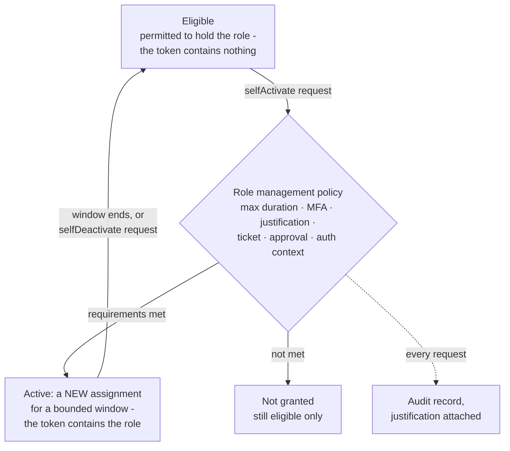

# PIM-Based Just-in-Time Lab Access

> **Objective:** (Project prerequisite - doubles as practice for 01-01)
> Requires **Microsoft Entra ID P2**. A trial is sufficient.

## Why this exists

Objective 01-01's first bullet is `Implement and configure Privileged Identity
Management (PIM)`. You are going to study it anyway. So rather than learn PIM
once in a lab and then spend the next seventeen modules working as a standing
Global Administrator — which is the exact posture PIM exists to eliminate — you
configure it now and use it for every lab that follows.

Two things come out of that:

- You get roughly forty repetitions of the activation flow instead of one.
- Your lab tenant stops being a counter-example to its own curriculum.

There is a practical benefit too. Standing Global Admin makes every lab succeed,
which hides permission errors. Working from least privilege means when a lab
fails with a 403, you learn something real about which role actually governs
that operation. That knowledge is directly exam-relevant; the questions care
about which role does what.

## How it works under the hood

PIM replaces a single concept (you have a role) with two:

- **Eligible.** You are *permitted* to hold the role. You do not hold it. Your
  token contains nothing.
- **Active.** You hold the role right now, usually for a bounded window. Your
  token contains it.

Activation is the transition, and it is a request that PIM evaluates against a
policy before granting. In the Graph model these are separate object families:

| Concept | Graph object |
| --- | --- |
| "You may hold this role" | `unifiedRoleEligibilitySchedule` |
| "You hold this role now" | `unifiedRoleAssignmentSchedule` |
| "Please make me active" | `unifiedRoleAssignmentScheduleRequest` (action `selfActivate`) |
| "The rules for activating" | `unifiedRoleManagementPolicy` and its rules |

The important structural point: **activation mints a new assignment, it does not
flip a flag on the eligibility.** That is why activation and deactivation are
both *requests* (`selfActivate` / `selfDeactivate`), and why each one leaves an
audit record with justification attached.

### Two PIM surfaces, and the exam tests both

This catches people constantly. PIM governs two different authorization systems
that share a UI but nothing else:

| | Entra roles | Azure resource roles |
| --- | --- | --- |
| Governs | Directory objects: users, apps, CA policies, tenant settings | Subscriptions, resource groups, resources |
| Example roles | Global Administrator, Security Administrator, Privileged Role Administrator | Owner, Contributor, Key Vault Administrator |
| Scope model | Tenant `/`, or an administrative unit | Management group → subscription → RG → resource |
| PowerShell | `Microsoft.Graph.Identity.Governance` (`*RoleManagementDirectory*`) | `Az.Resources` (`New-AzRoleEligibilityScheduleRequest`, `New-AzRoleAssignmentScheduleRequest`) |
| API | Microsoft Graph | Azure Resource Manager |

Being Global Administrator gives you nothing in the second column. This is the
same separation described in
[00-00](./00-00-module-overview.md#the-one-thing-global-administrator-does-not-give-you).
Your lab needs eligible assignments in **both**.

### The activation policy is the actual control

The eligibility says who. The **role management policy** says under what
conditions, and it is where most of the exam-relevant configuration lives:

- Maximum activation duration
- Require MFA on activation
- Require justification
- Require ticket information
- Require approval, and who approves
- Require Conditional Access authentication context
- Notification recipients on eligible assignment, activation, and expiry

Setting a role to eligible with a policy that requires nothing is theatre. The
policy is the security control; the eligibility is just the roster.

The whole path in one picture. Nothing in it goes beyond the two sections above.

The return arrow is to the same eligibility: activation created a separate assignment
and never changed it.

## Configuration surface

### Roles to make yourself eligible for

Do not make yourself eligible for Global Administrator and stop. Granular
eligibility is the point, and it forces you to learn the role boundaries.

| Role | Type | Needed by |
| --- | --- | --- |
| Global Administrator | Entra | Break-glass only. Eligible, high friction, rarely activated. |
| Privileged Role Administrator | Entra | Managing PIM itself, 01-01 |
| Security Administrator | Entra | Defender configuration, 03-xx, 04-xx |
| Conditional Access Administrator | Entra | 01-01 |
| Application Administrator | Entra | App registrations, consent, 01-01 |
| Compliance Administrator | Entra | Purview DSPM, 03-01 |
| Owner *or* Contributor + User Access Administrator | Azure resource | Most Azure labs |
| Key Vault Administrator | Azure resource | 01-02 |

Contributor plus User Access Administrator is worth preferring over Owner,
because it makes the "who can grant access" boundary visible rather than
invisible.

### Recommended policy settings for a lab

| Setting | Lab value | Reasoning |
| --- | --- | --- |
| Max activation duration | 4 hours | Longer than a lab session, shorter than a workday. Forces a natural teardown checkpoint. |
| Require MFA on activation | Yes | Also required by the Graph API for self-service operations regardless. |
| Require justification | Yes | Builds the habit and populates the audit log you will read in 04-04. |
| Require ticket info | No for most, **Yes for Global Administrator** | Adds friction exactly where you want friction. |
| Require approval | No (you are the only approver) | Configure it once on one role anyway, to see the flow. |
| Notifications | On | You want to see what the alert looks like. |

## Common failure modes

**Self-activation over Graph requires an MFA-challenged session.** Microsoft's
documentation for
`New-MgRoleManagementDirectoryRoleAssignmentScheduleRequest` states the calling
user must have MFA enforced and must be in a session where MFA was actually
performed. A `Connect-MgGraph` session established without an MFA challenge will
fail the request even though your account has MFA registered. Reconnect and
complete the challenge.

**Removing your own standing role before eligibility works.** Configure the
eligible assignment, activate it once successfully, *then* remove the permanent
assignment. Doing it in the other order is how you lock yourself out. This is
what the emergency access accounts are for, but do not rely on them for a
self-inflicted ordering mistake.

**Entra role activation does not propagate instantly to every service.** Some
portals cache authorization. Signing out and back in after activation resolves
most of it. Token lifetime means the reverse is also true: deactivating a role
does not immediately invalidate an existing token everywhere.

**PIM requires P2 and the trial expires.** When the trial lapses, existing
eligible assignments stop being activatable. Know your trial end date; it may
land mid-study.

**Activation duration is capped by policy, not by your request.** Requesting
`PT8H` against a policy with a 4-hour maximum fails rather than silently
truncating.

## Hands-on

See [00-02 lab](../../labs/00-lab-safety/00-02-lab.md).

## Check yourself

1. What is the difference between a `unifiedRoleEligibilitySchedule` and a
   `unifiedRoleAssignmentSchedule`, and which one does activation create?
2. You are Global Administrator, activated through PIM. `New-AzResourceGroup`
   returns a 403. Explain why, without guessing.
3. Which object holds the requirement that activating Security Administrator
   needs a ticket number — the eligibility or something else?
4. You activate a role for 4 hours and deactivate after 10 minutes. Is your
   access gone everywhere immediately? Why or why not?
5. Why is granting yourself eligible Owner at subscription scope a worse lab
   design than eligible Contributor plus eligible User Access Administrator?

## Sources

- What is Privileged Identity Management: <https://learn.microsoft.com/en-us/entra/id-governance/privileged-identity-management/pim-configure>
- Activate my Microsoft Entra roles in PIM: <https://learn.microsoft.com/en-us/entra/id-governance/privileged-identity-management/pim-how-to-activate-role>
- Assign Azure resource roles in PIM: <https://learn.microsoft.com/en-us/entra/id-governance/privileged-identity-management/pim-resource-roles-assign-roles>
- `New-MgRoleManagementDirectoryRoleAssignmentScheduleRequest`: <https://learn.microsoft.com/en-us/powershell/module/microsoft.graph.identity.governance/new-mgrolemanagementdirectoryroleassignmentschedulerequest>
- Elevate access to manage all Azure subscriptions: <https://learn.microsoft.com/en-us/azure/role-based-access-control/elevate-access-global-admin>
