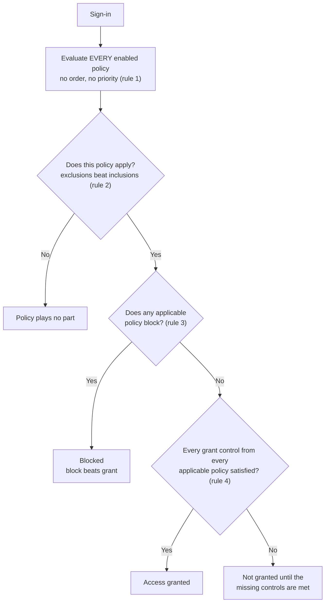

# Secure Access with Microsoft Entra ID

> **Objective:** Secure access to resources by using Microsoft Entra ID
> **Domain:** Manage identity, access, and governance (20-25%)

## Sub-objectives covered

- Implement and configure Privileged Identity Management (PIM)
- Implement conditional access policies
- Implement and configure authentication methods, including multifactor authentication (MFA) and passwordless
- Implement and configure identity for applications, including enterprise applications and app registrations
- Manage OAuth permission grants and consent settings
- Implement and configure managed identities for Azure resources

> **PIM is taught in [00-02](../00-lab-safety/00-02-pim-just-in-time-lab-access.md)** and you have been using
> it for every lab since. This module does not repeat it. Re-read 00-02 if the
> eligible/active distinction or the role management policy is not yet automatic
> for you - the exam tests it directly and it is the first bullet of this objective.

## Why this exists

Strip away the product names and every one of these six bullets answers one of
three questions about a request for data:

1. **Who is asking?** A human, an application acting for a human, or an
   application acting for itself.
2. **What did they have to prove, and how strong was the proof?**
3. **What are they allowed to do once they are in, and who decided that?**

The old answer to all three was the network. If the request came from inside the
building, it was trusted. That model failed for a boring reason rather than a
philosophical one: the data left the building. Once the mailbox is in Exchange
Online and the file is in SharePoint, "inside" is wherever the token is.

So the control point moved to the identity provider, and the unit of access became
**the token, not the login**. That single shift explains the shape of everything
below:

- A stolen password is indistinguishable from a typed one. So authentication had
  to stop being one fact (a secret) and start being a **policy** over several
  facts - hence authentication methods and Conditional Access.
- An attacker who cannot get a password can instead persuade a user to *grant an
  app access* on their behalf. That attack needs no credential theft at all,
  which is why **consent is a security boundary** rather than an IT convenience
  setting.
- An application that needs to read a storage account needs a credential. Every
  credential you create is a credential you can leak. **Managed identities** exist
  to remove the credential from the problem entirely.
- A role that is always on is always available to whoever steals the account.
  Hence **PIM**, covered in 00-02.

The failure mode in each case is rarely "the control was missing." It is "the
control was present and scoped to the wrong thing." An MFA requirement that
excludes the service account, a consent setting that permits any publisher, a
user-assigned managed identity shared by fourteen resources - all of these pass a
checklist.

## How it works under the hood

### The request path

Every control in this module sits at a different point on the same line. Knowing
*which* point is most of what the exam is testing.

```
   credential           Conditional Access           token                 resource
   presented      →     policy evaluation      →     issued         →      authorizes
       │                       │                       │                       │
 authentication         all applicable            carries scopes         Azure RBAC, or
 methods policy         policies evaluated;       (delegated) and        Graph permission
 decides WHICH          block wins over           roles (application)    check, or the
 proofs exist           grant                     granted by CONSENT     app's own logic
```

Three consequences fall out of that line:

**Conditional Access runs after first-factor authentication.** The engine needs to
know who you claim to be before it can decide what else you must prove. So CA is
not a front-door defence against password spraying - the first factor is already
evaluated by the time CA gets a say. It is also why a blocked sign-in still appears
in the sign-in log against a recognised user.

**Consent happens once and persists.** The token carries permissions; those
permissions came from a grant object created at consent time, and it stays until
someone removes it. A user who consented eighteen months ago is still consenting
today. This is the most important sentence in the module for anyone with an
incident-response background.

**Authorization at the resource is a separate system.** Entra issues the token.
Azure RBAC decides what it can touch in a subscription. Microsoft Graph decides
what it can touch in the directory. Neither re-litigates the CA decision.

### Conditional Access: the evaluation model

A policy is an if-then statement: **assignments** describe when it applies,
**access controls** describe what is then required.

The rules that decide outcomes, in the order they matter:

1. **Every enabled policy is evaluated on every sign-in.** No ordering, no
   first-match, no priority number. A policy either applies or it does not.
2. **Exclusions beat inclusions.** Inside one policy an excluded user is out, even
   if they are also in an included group. This is the mechanism your break-glass
   accounts depend on.
3. **Block beats grant.** If any applicable policy blocks, the sign-in is blocked,
   however many others would have granted.
4. **Across policies, all grant controls must be satisfied.** Policy A requiring
   MFA and policy B requiring a compliant device means the user needs both.
5. **Within one policy, multiple grant controls are AND or OR** depending on the
   "Require all the selected controls" / "Require one of the selected controls"
   radio button. Getting this backwards is both a classic exam distractor and a
   classic production outage.

The same rules as a decision flow. Every box restates one of the five rules above;
nothing here is additional behaviour.



**Report-only** is a fourth policy state alongside On and Off: the policy is fully
evaluated and the result is written to the sign-in log, but nothing is enforced.
**What If** is a different thing - it simulates a hypothetical sign-in you
describe, against enabled and report-only policies, with no real sign-in taking
place. What If does not account for Conditional Access service dependencies: a
policy on a dependent service (the classic case being Exchange Online underneath
Teams) will not appear in the result even though it will bite in production.

Security defaults and Conditional Access are **mutually exclusive**. A tenant with
security defaults enabled cannot use CA policies; you turn security defaults off to
use the policy engine. Expect a scenario question built on this.

### Authentication methods: what you are allowed to prove with

Conditional Access can demand MFA. The **Authentication methods policy** determines
which methods exist to satisfy that demand, targeted per user or group, with
exclusions.

The structural fact the exam cares about: this policy **replaced** the two legacy
surfaces. Since **30 September 2025**, authentication methods can no longer be
managed in the legacy multifactor authentication settings or the self-service
password reset policy. Any prep material telling you to enable a method in "MFA
service settings" is describing a control that no longer functions.

**Authentication strengths** bridge the two features. A strength is a named set of
acceptable method combinations - built-ins are MFA, passwordless MFA, and
phishing-resistant MFA, plus custom ones you define. A CA grant control can require
a specific strength instead of generic "require MFA," which is how you express
"admins must use a passkey or certificate, SMS is not acceptable" as policy rather
than as a memo.

### Application identity: two objects, one app

This trips up almost everyone once.

| | App registration | Enterprise application |
| --- | --- | --- |
| Graph object | `application` | `servicePrincipal` |
| Portal blade | App registrations | Enterprise applications |
| What it is | The definition. Exists once, in the home tenant. | The local instance, one per tenant that uses the app. |
| Identifier | `appId` (client ID) - **shared by both** | `id` (object ID) - different from the registration's object ID |
| Holds | Redirect URIs, requested permissions, credentials | Actual permission grants, user/group assignments, sign-in records |

The registration is the blueprint; the service principal is the building. You
*request* permissions on the registration. You *hold* permissions on the service
principal. A multi-tenant app has one registration and a service principal in every
tenant that ever consented - which is why deleting the registration does not clean
up anything in someone else's tenant.

Credentials hang off the registration: a **client secret** (a password, with an
expiry), a **certificate**, or a **federated identity credential** - no stored
secret at all, an external issuer's token exchanged for an Entra token. Federated
credentials are the exam's answer to "authenticate a GitHub Actions workflow or a
Kubernetes workload without a secret."

### Delegated versus application permissions

This is the distinction that makes consent a security control.

- **Delegated** permissions apply when the app acts *for a signed-in user*.
  Effective access is the **intersection** of what the app was granted and what the
  user could already do. An app with `Files.Read.All` delegated, used by someone
  who can see three sites, sees three sites.
- **Application** permissions apply when the app acts *as itself*, with no user in
  the picture. There is nothing to intersect with. `Mail.Read` as an application
  permission is every mailbox in the tenant.

Same permission name, radically different blast radius. Application permissions
always require admin consent.

### Consent, as an object

Consent is not a setting - it creates a durable object:

| Consent type | Object created |
| --- | --- |
| Delegated | `oauth2PermissionGrant`, scoped to one user or to all users |
| Application | `appRoleAssignment` on the service principal |

Tenant-wide admin consent creates the grant for everybody at once, which makes the
admin consent button a genuinely privileged action rather than a shortcut. It does
not, however, equal access for everybody: setting the enterprise application to
require user assignment still gates who can use it.

User consent settings offer three positions:

1. **Do not allow user consent.** Only privileged roles can consent.
2. **Allow for verified publishers and your own apps, limited to permissions you
   classify as low impact.** The recommended middle ground - and it does nothing
   until you actually classify permissions.
3. **Allow user consent for all applications.** The permissive end.

By default, users can consent to permissions that do not themselves require
administrator consent. Tightening this without turning on the **admin consent
workflow** converts a consent problem into a help desk problem: users hit a wall
with no route through it.

### Managed identities

A managed identity is a service principal whose credential you are never given and
cannot extract. Azure holds it and rotates it.

| | System-assigned | User-assigned |
| --- | --- | --- |
| Lifecycle | Tied to one resource; deleted with it | Standalone Azure resource; survives independently |
| Sharing | One resource only, by design | Attachable to many resources |
| Service principal name | Same as the resource | Same as the identity resource |
| Use when | A single resource needs its own identity | Several resources share one identity, or the identity must pre-exist the resource |

The mechanism: code on the resource requests a token from a local endpoint - the
Azure Instance Metadata Service on a VM, or the identity endpoint injected into App
Service and Functions - and the platform returns an Entra access token for the
requested resource. No secret in code, in config, or in Key Vault.

Two consequences, both exam-relevant and incident-relevant:

- **Enabling a managed identity grants nothing.** It creates a principal. You then
  assign an Azure RBAC role, a Graph permission, or Key Vault access. This two-step
  is the most common "I enabled it and it still returns 403" scenario.
- **The trust boundary is the resource, not the code.** Anything that can reach that
  local endpoint from inside the VM gets the token, carrying whatever RBAC you
  assigned. A server-side request forgery bug in a web app on that VM is a
  credential disclosure. Least privilege on a managed identity is not paperwork.

## Configuration surface

| Control | Default | Set it to | Why |
| --- | --- | --- | --- |
| Security defaults | On in new tenants | Off, once CA policies exist | Mutually exclusive with Conditional Access |
| New CA policy state | Off | Report-only, then On | Enforcing an untested policy against All users is how tenants lock |
| CA target resources | none | All resources, with deliberate exclusions | Per-app policies leave a gap at the next app onboarded |
| CA break-glass exclusion | none | Both emergency accounts, on every policy | The only recovery path that does not depend on the mistake being survivable |
| Legacy MFA / SSPR method management | frozen since 2025-09-30 | n/a - use the Authentication methods policy | The legacy surfaces no longer manage methods |
| Authentication strength on admin policies | "Require MFA" (any method) | Phishing-resistant MFA | Generic MFA accepts SMS; that is not the same control |
| Users can register applications | Yes | No, for a production-shaped tenant | Any user can otherwise create a credential-bearing identity |
| User consent | Allowed for non-admin permissions | Verified publishers + classified low-impact permissions | Directly mitigates illicit consent grant attacks |
| Admin consent workflow | Off | On, with named reviewers | Restricting consent without a request path produces shadow IT |
| Managed identity | Not enabled | System-assigned unless sharing is required | Lifecycle coupling makes teardown automatic |
| Managed identity RBAC scope | none | Narrowest scope that works | The token is obtainable by anything running on the resource |

## Common failure modes

**The policy that locks the tenant.** "All users, All resources, require compliant
device," no exclusions, saved as On, by an admin on a non-compliant device.
Report-only and break-glass exclusions exist for exactly this and are the two steps
people skip.

**Report-only read as enforcement.** The sign-in log shows `Report-only: Not
applied` for 24 hours and the admin concludes the policy is safe. Two possible
causes: the policy genuinely would not apply, or nothing matching its conditions has
signed in yet. Only one of those is reassuring.

**What If mistaken for a full simulation.** No service dependency evaluation, so a
Teams result that looks clean can still be blocked by an Exchange Online policy in
production.

**Grant controls ANDed when OR was meant, or the reverse.** "Require MFA" plus
"Require compliant device" with the radio on *one of the selected controls* is a
materially weaker policy than the same two with *all*. Nothing in the UI warns you.

**MFA required but registration unprotected.** If a user can register a new MFA
method from anywhere, an attacker holding the password registers their own method
and satisfies your MFA requirement legitimately. Protect the registration action and
bootstrap new users with a Temporary Access Pass rather than leaving registration
open.

**Consent tightened with no workflow.** Predictable and immediate, as above.

**Application permission used where delegated would do.** Requested because the
delegated flow was harder to implement, approved because the permission name looked
familiar. `Mail.Read` is a very different thing in the two columns.

**Client secrets that outlive their owner.** Either they expire and the app breaks
at 2am, or they do not expire soon enough and an orphaned app registration keeps a
working credential indefinitely. Certificates or federated credentials for anything
that matters; an expiry inventory for the rest.

**Orphaned role assignments after a managed identity disappears.** Delete the
resource, the system-assigned service principal goes with it, and the Azure role
assignment stays behind pointing at a principal that no longer resolves. Covered as
a teardown bucket in
[00-03](../00-lab-safety/00-03-teardown-checklist-template.md), and again as an
exam objective in 01-03, which asks you to find and remediate exactly this artifact.

**One user-assigned identity attached to everything.** Convenient, and it means
every resource carrying it holds the union of all permissions any of them needed.

## How this is tested

SC-500 scenario questions are usually decided by one constraint in the stem. The
mappings that recur:

| Phrase in the question | What it steers you to |
| --- | --- |
| "without storing credentials" / "no secrets in code" | Managed identity |
| "shared by multiple resources" / "must exist before the VM" | User-assigned managed identity |
| "identity must be removed when the resource is deleted" | System-assigned managed identity |
| "with no signed-in user" / "background daemon" | Application permission, admin consent required |
| "on behalf of the signed-in user" | Delegated permission |
| "only apps from verified publishers" | User consent settings |
| "users must be able to request access" | Admin consent workflow |
| "phishing-resistant" / "SMS is not acceptable" | Authentication strength, not plain "require MFA" |
| "evaluate impact before enforcing" | Report-only |
| "simulate a sign-in" | What If |
| "least privilege" + "only when needed" | PIM eligible assignment |

Role boundaries are tested directly too. Conditional Access Administrator for
policies, Authentication Policy Administrator for the authentication methods policy,
Privileged Role Administrator for user consent settings and PIM, Application
Administrator for app registrations and enterprise apps, Global Administrator to
enable the admin consent workflow. The exam likes asking for the *least* privileged
role that can do a task, and Global Administrator is almost never the answer.

**AZ-500 divergence.** The controls are largely continuous with AZ-500; the surface
has moved. Authentication method management now exists only in the Authentication
methods policy, and Conditional Access has grown targeting for agent identities,
which connects this module to the Entra Agent ID material in Domain 3 (03-02). Do
not trust an AZ-500-era walkthrough for portal paths.

## Hands-on

See [01-01 lab](../../labs/01-identity-access-governance/01-01-lab.md).

## Check yourself

1. You create a policy requiring a compliant device for All users and All
   resources, in report-only. After 24 hours every sign-in shows
   `Report-only: Not applied`. Give two different explanations and describe how you
   would tell them apart.
2. App A holds `Mail.Read` as a delegated permission. App B holds `Mail.Read` as an
   application permission. A user with access to one mailbox signs into App A.
   Describe what each app can read, and explain why the difference is not a
   property of the permission name.
3. Your Automation account from 00-01 has a system-assigned identity holding
   Contributor at subscription scope. You delete the Automation account. What
   exists afterwards in the directory, what exists in the subscription, and which
   one becomes a finding in an access review?
4. You set user consent to verified publishers with low-impact permissions, and do
   not enable the admin consent workflow or classify any permissions. Predict what
   happens in the first week.
5. Policy A requires MFA. Policy B requires a compliant device. Policy C blocks
   sign-ins from a country. A user in scope of all three signs in from that country
   with MFA and a compliant device. What is the outcome, and which rule decides it?

## Sources

- Microsoft Learn - SC-500 skills measured: <https://learn.microsoft.com/en-us/credentials/certifications/resources/study-guides/sc-500>
- What is Conditional Access: <https://learn.microsoft.com/entra/identity/conditional-access/overview>
- Conditional Access What If policy tool: <https://learn.microsoft.com/entra/identity/conditional-access/what-if-tool>
- Manage authentication methods for Microsoft Entra ID: <https://learn.microsoft.com/entra/identity/authentication/concept-authentication-methods-manage>
- Manage authentication methods (migration guide): <https://learn.microsoft.com/entra/identity/authentication/how-to-authentication-methods-manage>
- User and admin consent overview: <https://learn.microsoft.com/en-us/entra/identity/enterprise-apps/user-admin-consent-overview>
- Configure how users consent to applications: <https://learn.microsoft.com/entra/identity/enterprise-apps/configure-user-consent>
- Configure the admin consent workflow: <https://learn.microsoft.com/en-us/entra/identity/enterprise-apps/configure-admin-consent-workflow>
- What are managed identities for Azure resources: <https://learn.microsoft.com/en-us/entra/identity/managed-identities-azure-resources/overview>
- Manage user-assigned managed identities: <https://learn.microsoft.com/en-us/entra/identity/managed-identities-azure-resources/how-manage-user-assigned-managed-identities>
